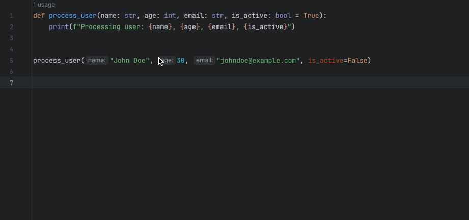

# Extract to Dataclass

A PyCharm plugin that enables refactoring of function arguments into separate dataclasses.

## Overview

This plugin introduces an "Extract to Dataclass" refactoring action, allowing you to quickly organize function
parameters into structured dataclasses. It's designed to enhance your code's readability and maintainability in Python
projects.

## Example

## Key Features

- 🚀 Extract selected function parameters into a new dataclass
- 🔍 Type-friendly: preserve existing type annotations, including generic types
- 🔄 Automatically update function calls and parameter usages
- 📦 Handle dataclass imports and type annotations

## Installation

The plugin requires PyCharm 2023.1 or later.

1. Open PyCharm
2. Navigate to `Settings/Preferences` → `Plugins`
3. Search for "Extract to Dataclass"
4. Click `Install`

## Usage

1. Select function that requires refactoring
2. Access via right-click `Refactor` menu
3. Select `Extract arguments to dataclass`
4. Choose parameters to extract
5. Specify dataclass and parameter names (or use defaults)
6. Confirm to perform the refactoring

## License

This project is licensed under the MIT License. See the [LICENSE](LICENSE) file for details.
